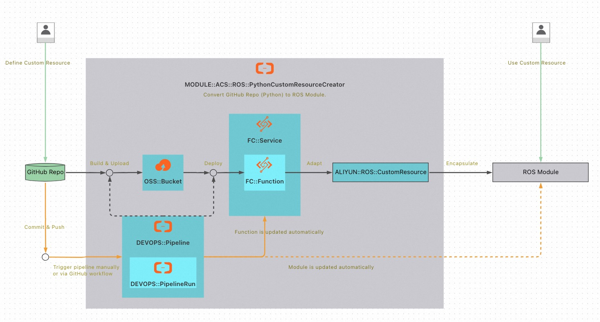
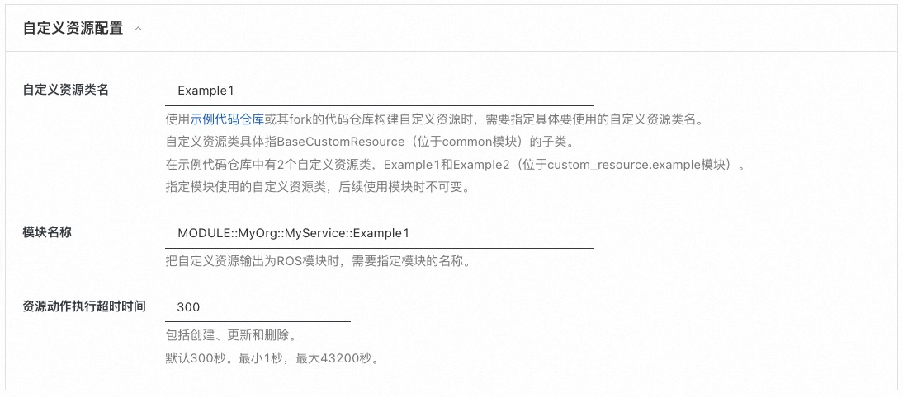
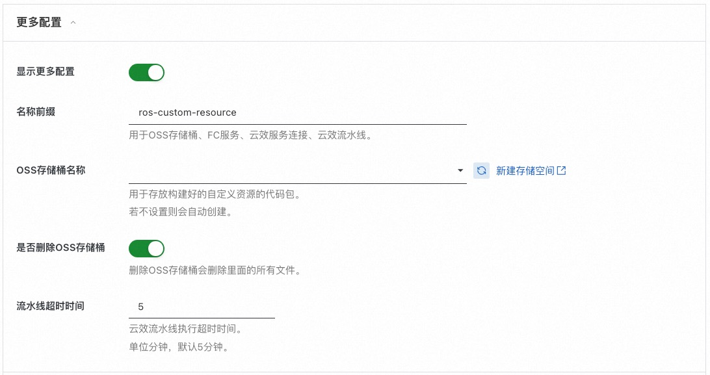
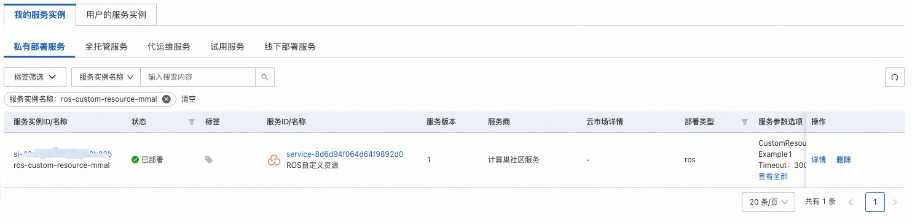
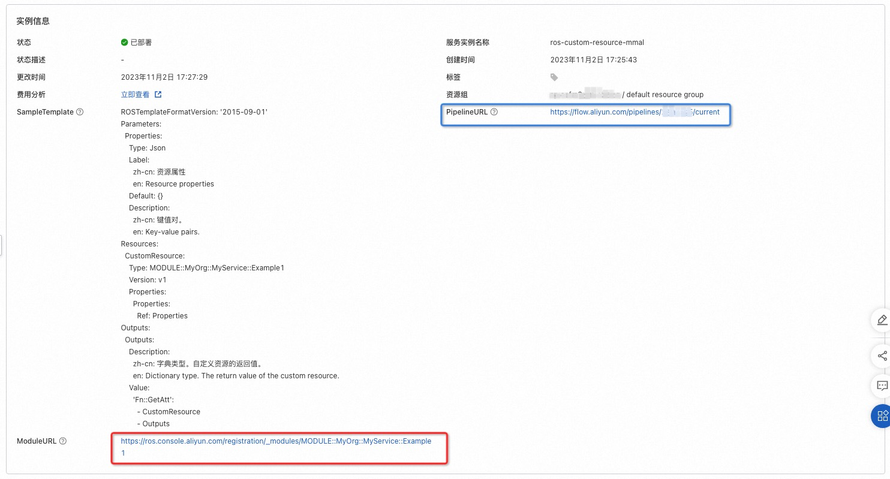
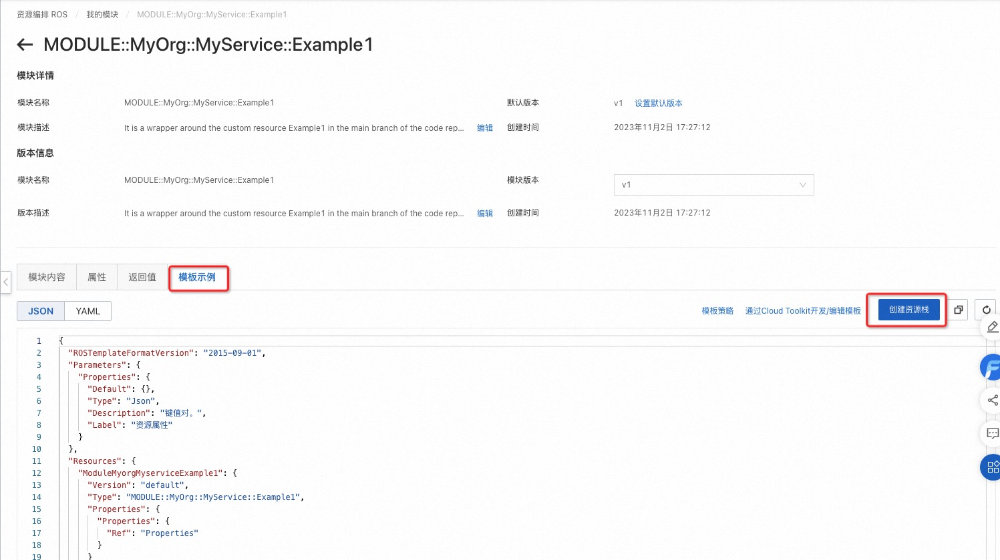
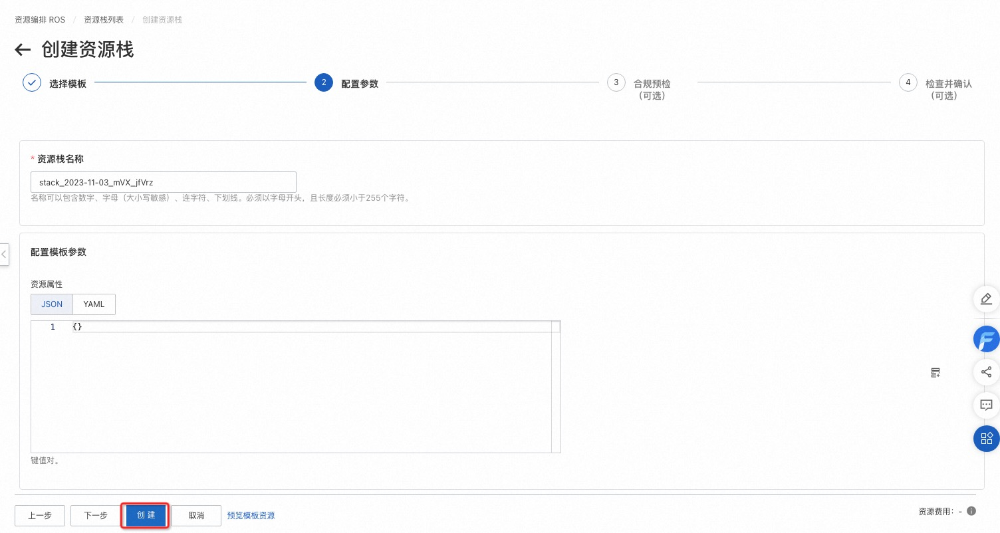
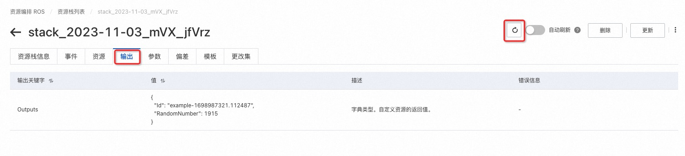
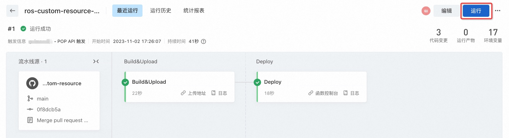

# ROS自定义资源服务实例部署文档

## 概述

阿里云资源编排服务ROS（Resource Orchestration Service）可以帮助您简化云计算资源的管理。 
遵循ROS定义的模板规范，您可以定义所需云计算资源的集合及资源间的依赖关系。
ROS可以自动完成所有资源的创建和配置，实现自动化部署和运维。

ROS不仅能够编排阿里云资源，还支持自定义资源。
使用自定义资源，您可以在模板中编写自定义配置逻辑。
当您创建、更新（如果您更改了自定义资源）或删除资源栈时，ROS会运行该逻辑。

`ROS自定义资源`服务可以把GitHub代码仓库（Python语言）构建和部署为ROS自定义资源，并输出ROS模块，方便后续使用。

本文向您介绍如何开通计算巢上的`ROS自定义资源`服务，以及部署流程和使用说明。

## 计费说明

`ROS自定义资源`服务在计算巢上的费用主要涉及：

- [对象存储OSS费用](https://help.aliyun.com/zh/oss/product-overview/billing-overview)：构建好的代码包会放在OSS中。计费项涉及存储、流量和请求。
- [云效费用](https://help.aliyun.com/document_detail/173288.html)：会创建和执行流水线。基础版免费，但有限额。
- [函数计算](https://help.aliyun.com/zh/fc/product-overview/billing-overview)：部署服务不产生此项费用，后续使用构建好的自定义资源或模块时会产生此项费用。计费项涉及函数调用、资源使用、公网出流量。首次开通前3个月有试用额度。

## 部署架构

如下图所示，计算巢会进行如下部署：
- 创建OSS存储桶、函数计算服务和函数、云效流水线等资源。
- 执行云效流水线：下载GitHub代码、构建代码包、上传到OSS存储桶、部署到函数计算函数。
- 适配函数计算函数为ROS自定义资源，把ROS自定义资源封装为ROS模块，供后续使用。

GitHub代码更新后，可以手动触发或通过GitHub Workflow自动触发云效流水线。

## RAM账号所需权限

`ROS自定义资源`服务需要对OSS、FC、RDC、ECS、RAM等服务的资源进行访问和创建操作，若您使用RAM用户创建服务实例，需要在创建服务实例前，对使用的RAM用户的账号添加相应资源的权限。添加RAM权限的详细操作，请参见[为RAM用户授权](https://help.aliyun.com/document_detail/121945.html)。所需权限如下表所示。

| 权限策略名称                          | 备注                                                                                                                   |
|---------------------------------|----------------------------------------------------------------------------------------------------------------------|
| AliyunOSSFullAccess             | 管理对象存储服务(OSS)权限                                                                                                      |
| AliyunFCFullAccess              | 管理函数计算(FC)服务的权限                                                                                                      |
| AliyunRDCFullAccess             | 管理云效(RDC)的权限                                                                                                         |
| AliyunECSReadOnlyAccess         | 只读访问云服务器服务(ECS)的权限                                                                                                   |
| AliyunRAMFullAccess             | 管理访问控制(RAM)的权限，即管理用户以及授权的权限。如果缺少角色AliyunFcDefaultRole、AliyunRDCDefaultRole则需要此权限创建角色。否则只需要AliyunRAMReadOnlyAccess权限。 |
| AliyunROSFullAccess             | 管理资源编排服务(ROS)的权限                                                                                                     |
| AliyunComputeNestUserFullAccess | 管理计算巢服务（ComputeNest）的用户侧权限                                                                                           |

## 部署流程

### 部署步骤

1.单击[部署链接](https://computenest.console.aliyun.com/user/cn-hangzhou/serviceInstanceCreate?ServiceId=service-8d6d94f064d64f9892d0)，进入服务实例部署界面，根据界面提示，填写参数完成部署。

2.在**创建服务实例**页，配置部署参数。

3.点击下一步：确认订单。

4.查看订单页，确保依赖检查全部正常，点击立即创建。

### 部署参数说明

| 参数组      | 参数项       | 示例                                                                       | 说明                                                                                                                                                                                                                                                                      |
|----------|-----------|--------------------------------------------------------------------------|-------------------------------------------------------------------------------------------------------------------------------------------------------------------------------------------------------------------------------------------------------------------------|
| 服务实例名称   |           | ros-custom-resource-test                                                 | 实例的名称                                                                                                                                                                                                                                                                   |
| 地域       |           | 华北2（北京）                                                                  | 选中服务实例的地域，建议就近选中，以获取更好的网络延时。                                                                                                                                                                                                                                            |
| 代码配置     | GitHub代码仓库地址 | https://github.com/aliyun-computenest/quickstart-ros-custom-resource.git | 建议从[示例代码仓库](https://github.com/aliyun-computenest/quickstart-ros-custom-resource)fork。                                                                                                                                                                                  |
| 代码配置     | GitHub代码仓库分支 | main                                                                     | 要使用的分支。                                                                                                                                                                                                                                                                 |
| 代码配置     | Python版本  | python3.9                                                                | Python版本。                                                                                                                                                                                                                                                               |
| 云效配置     | 云效企业      |  6542ffd18281************                                                             | 下拉选择或者创建。                                                                                                                                                                                                                                                               |
| 云效配置     | 云效GitHub服务连接 | re6dh9rs********                                                      | 下拉选择或者创建。                                                                                                                                                                                                                                                               |
| 自定义资源配置  | 自定义资源类名   | Example1                                                                 | 使用[示例代码仓库](https://github.com/aliyun-computenest/quickstart-ros-custom-resource)或其fork的代码仓库构建自定义资源时，需要指定具体要使用的自定义资源类名。 自定义资源类具体指BaseCustomResource（位于common模块）的子类。 在示例代码仓库中有2个自定义资源类，Example1和Example2（位于custom_resource.example模块）。 指定模块使用的自定义资源类，后续使用模块时不可变。 |
| 自定义资源配置  | 模块名称          | MODULE::MyOrg::MyService::Example1                                       | 把自定义资源输出为ROS模块时，需要指定模块的名称。                                                                                                                                                                                                                                              |
| 自定义资源配置  | 资源动作执行超时时间         | 300                                                                      | 包括创建、更新和删除。  默认300秒。最小1秒，最大43200秒。                                                                                                                                                                                                                                   |
| 更多配置     | 名称前缀          | ros-custom-resource                                                      | 用于OSS存储桶、FC服务、云效服务连接、云效流水线。                                                                                                                                                                                                                                             |
| 更多配置     | OSS存储桶名称          | my-bucket                                                                | 用于存放构建好的自定义资源的代码包。 若不设置则会自动创建。                                                                                                                                                                                                                                       |
| 更多配置     | 是否删除OSS存储桶          | true                                                                     | 删除OSS存储桶会删除里面的所有文件。仅删除自动创建的OSS存储桶。                                                                                                                                                                                                                                      |
| 更多配置     | 流水线超时时间          | 5                                                                        | 云效流水线执行超时时间。 单位分钟，默认5分钟。                                                                                                                                                                                                                                             |

### 验证结果

1.查看服务实例。服务实例创建成功后，部署时间大约需要2分钟。部署完成后，页面上可以看到对应的服务实例。点击服务实例，进入**服务实例详情**页面。

2.查看**服务实例详情**页面中的**实例信息**，点击**ModuleURL**处链接（红框处），进入**模块详情**页面。

3.查看**模块详情**页面，选择**模板示例**标签页，点击**创建资源栈**，进入**创建资源栈**页面。

4.在**创建资源栈**页面点击**创建**按钮，进入**资源栈详情**页面。

5.在**资源栈详情**页面，等待几秒钟，点击刷新按钮，等待资源栈创建完成。创建完成后，选择**输出**标签页。如果结果类似下图，则表明自定义资源模块部署成功，后续可以在其他模板中使用。

### 同步仓库代码到自定义资源模块

查看**服务实例详情**页面中的**实例信息**，点击**PipelineURL**处链接（蓝框处），可以访问云效流水线。

如果仓库中的代码更新了，您可以点击**运行**按钮运行流水线以更新自定义资源模块。

您也可以配置GitHub Workflow，在代码更新后触发云效流水线，实现自动进行同步。

### 自定义资源模块使用示例

查看**服务实例详情**页面中的**实例信息**，SampleTemplate处的模板为自定义资源模块的使用示例。您可以参考使用，也可以直接复制使用。

## 帮助文档
- [ROS模块](https://help.aliyun.com/zh/ros/user-guide/module)
- [ROS自定义资源](https://help.aliyun.com/document_detail/145907.html)
- [ALIYUN::ROS::CustomResource](https://help.aliyun.com/document_detail/145579.html)
- [资源编排ROS之自定制资源（基础篇）](https://developer.aliyun.com/article/740364)
- [资源编排ROS之自定制资源（多云部署AWS篇）](https://developer.aliyun.com/article/740198)
- [资源编排ROS之自定制资源（多云部署Terraform篇）](https://developer.aliyun.com/article/740363)
